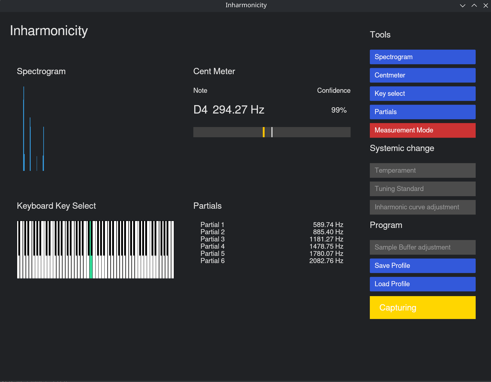

# Inharmonicity - Professional Piano Tuning Application



An open source professional-grade piano tuning application built in Rust with real-time audio analysis, spectrogram visualization, and interactive piano keyboard interface. Designed for professional piano tuners with planned support for inharmonicity compensation via advanced tuning algorithms.

## Features

### Core Functionality

- **Real-time Audio Analysis**: Live audio capture and processing using CPAL
- **Spectrogram Visualization**: Real-time frequency spectrum display
- **Cent Meter**: Visual tuning accuracy indicator with color-coded feedback
- **Interactive Piano Keyboard**: 88-key piano interface with click-to-select frequency functionality
- **Cent Meter Confidence**: Probabilistic confidence value for auto-detected notes
- **Partials Analysis**: Harmonic partial frequency display
- **Inharmonicity Measurement**: Capture and analyze piano-specific inharmonicity characteristics
- **Profile Management**: Save and load piano tuning profiles with JSON persistence

### Planned Features

- **Inharmonicity Compensation**: Professional piano-specific tuning curves
- **Buffer Size Selection**: Choice between 2048 and 4096 sample buffers
- **Temperament Selection**: Support for various tuning temperaments
- **Tuning Standard Options**: A440 and other reference frequencies

### Technical Features

- **High-Performance Audio Processing**: FFT-based frequency analysis with YIN pitch detection and spectrum refinement
- **Thread-Safe Architecture**: Dedicated audio processing thread with crossbeam channels
- **Real-time Updates**: Continuous GUI updates with audio analysis

## 🏗️ Architecture

### Project Structure

```text
inharmonicity/
├── tuner-core/          # Audio processing and analysis engine
│   ├── src/
│   │   ├── audio.rs     # CPAL audio capture and stream management
│   │   ├── fft.rs       # FFT processing and spectrum analysis
│   │   ├── pitch.rs     # stateless pYIN pitch detection algorithm
│   │   ├── tuning.rs    # Musical note calculations and cent deviation, inharmonicity curve calculation
│   │   ├── inharmonicity.rs        # Inharmonicity constant calculation and profile management
│   │   ├── capture_processing.rs   # Audio frame processing strategies for inharmonicity measurement
│   │   └── lib.rs       # Core library exports and public API
│   └── Cargo.toml
├── tuner-gui/           # Iced-based GUI application
│   ├── src/
│   │   ├── main.rs      # Main application and event handling
│   │   └── ui/          # Modular GUI components and layout
│   │       ├── mod.rs           # UI module declarations
│   │       ├── main_display.rs  # Main layout and panel management
│   │       ├── cent_meter.rs    # Cent deviation meter widget
│   │       ├── piano_keyboard.rs # Interactive piano keyboard
│   │       ├── spectrogram.rs   # Frequency spectrum visualization
│   │       └── partials_display.rs # Harmonic partials display
│   └── Cargo.toml
└── Cargo.toml           # Workspace configuration
```

### Threading Model

- **GUI Thread**: Main Iced application thread handling user interface
- **Audio Thread**: Dedicated thread for audio capture and analysis
- **Communication**: Crossbeam channels for thread-safe data exchange
- **Real-time Processing**: ~46ms update intervals for smooth visualization

## 🚀 Getting Started

### Prerequisites

- Rust 1.70+
- Linux with ALSA/PulseAudio support
- X11 or Wayland display server

### Building and Running

```bash
# Clone the repository
git clone <repository-url>
cd inharmonicity

# Build the project
cargo build

# Run the GUI application
cargo run -p tuner-gui
```

### Dependencies

- **Iced 0.13.1**: Modern Rust GUI framework with canvas support
- **CPAL 0.16.0**: Cross-platform audio library
- **RustFFT 6.4.1**: High-performance FFT implementation
- **Crossbeam-channel 0.5.15**: Lock-free concurrent data structures
- **Anyhow 1.0.100**: Error handling utilities
- **Once-cell 1.18**: Lazy static initialization

## 🔬 Planned  Features

- **Stretch Tuning**: Compensation for the natural inharmonicity of piano strings
- **Partial Frequency Analysis**: Advanced analysis of harmonic partials
- **Young's Inharmonicity Model**: Implementation of the standard inharmonicity calculation
- **Custom Tuning Profiles**: User-defined tuning curves for specific piano models
- **Temperament Settings**: Various tuning temperaments (Equal, Just, etc.)
- **Tuning Profiles**: Save/load custom tuning configurations
- **Sample Buffer Adjustment**: Configurable audio buffer sizes (2048/4096)
- **Audio Device Selection**: Choose input device from GUI
- **Export Functionality**: Save tuning data and reports

At a much later date, complete piano voicing analysis may be implemented after core tuning functionality is complete.

## 🎛️ Usage

### Interface Overview

The application features a professional layout with:

1. **Spectrogram Panel**: Real-time frequency spectrum visualization
2. **Cent Meter**: Tuning accuracy indicator (-50 to +50 cents)
3. **Piano Keyboard**: Interactive 88-key piano for manual note selection
4. **Partials Panel**: Harmonic partial frequency display
5. **Control Sidebar**: Tool visibility toggles and settings
6. **Measurement Mode**: Automatic capturing of stable note sustain

## ⚠️ Known Issues

### Segfault on Exit (Linux Graphics Driver Issue)

**Issue**: The application segfaults when the window is closed on Linux systems.

**Root Cause**: This is a **known issue with the graphics driver cleanup chain**, specifically in the EGL/Wayland/OpenGL cleanup sequence. The segfault occurs in the graphics driver cleanup, not in the application code itself.

**Status**: This is a system-level graphics driver issue, not a bug in the application. The application functions correctly for its intended purpose.

## 📝 License

This project is licensed under the terms specified in the LICENSE file.

## 🤝 Contributing

Contributions are welcome! Please ensure that:

- Code follows Rust best practices
- Threading requirements are maintained
- Audio processing performance is preserved
- GUI responsiveness is maintained

## 📞 Support

For technical support or bug reports, please include:

- Operating system and version
- Graphics driver information
- Audio system details (ALSA/PulseAudio)
- Complete error logs if applicable

---

**Note**: The segfault on exit is a known graphics driver issue and does not affect the core functionality of the application. The tuning tools work perfectly during runtime.
