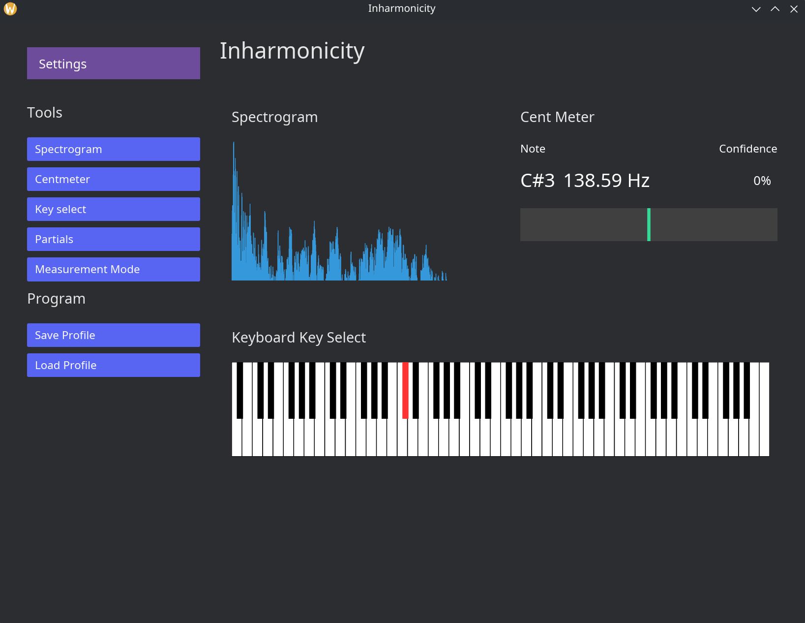

# Inharmonicity - Professional Piano Tuning Application



An open source professional-grade piano tuning application built in Rust with real-time audio analysis, pitch detection, and cent deviation measurement. Designed for piano tuners with planned support for inharmonicity compensation.

For a detailed overview of the algorithms used, see the [Anauseam documentation](https://docs.anauseam.org/project-docs/inharmonicity-tuner/00_intro).

> [!TIP]
> **Graphics Issues? Check Your Vulkan Drivers**
>
> This application uses `iced` with the `wgpu` backend (Vulkan on Linux). If you experience
> invisible widgets, flickering, or blank panels, the most common cause is stale or
> incompatible Vulkan drivers. Ensure your GPU drivers are fully up-to-date before
> reporting rendering bugs.

## Iced 0.14.0 UI

### Features

- **Spectrogram Visualization**: Real-time frequency spectrum display
- **Cent Meter**: Visual tuning accuracy indicator with color-coded feedback
- **Interactive Piano Keyboard**: 88-key piano interface with click-to-select frequency functionality
- **Inharmonicity Measurement**: Capture and analyze piano-specific inharmonicity characteristics
- **Profile Management**: Save and load piano tuning profiles with JSON persistence
- **Settings**: Noise floor calibration and envelope viewer

### Planned Features

- **Transient Detection Calibration**: Manual and automatic transient detection calibration
- **Inharmonicity Compensation**: Professional piano-specific tuning curves
- **Temperament Selection**: Support for various tuning temperaments
- **Tuning Standard Options**: A440 and other reference frequencies

### Work in Progress

- **TWM Pitch Detection**: Replacing DPYIN and bare QIFFT with Two-Way Mismatch (TWM) as the universal coarse F0 engine for both bass and treble registers. TWM supports targeted mode (user key hint), discovery mode (Scout-bounded), and inharmonicity template stretching.
- **XQIFFT Sub-Cent Refinement**: Exponentially-weighted QIFFT running after TWM to achieve sub-cent accuracy without additional FFT cost.
- **Linear Kalman Filter** *(experimental — may not ship)*: Gatekeeper-governed temporal smoothing stage. Engages only during the NINOS2-confirmed Stable phase; bypassed and reset on each new onset. Retention in the final release is undecided.

## Architecture

### Project Structure

```text
inharmonicity/
├── tuner-core/                     # Headless audio processing & analysis (no GUI code)
│   ├── src/
│   │   ├── algorithms/             # Stateless DSP building blocks
│   │   │   ├── spectral.rs         # FFT, Hann windowing, spectrum magnitude extraction
│   │   │   ├── pitch.rs            # XQIFFT (seeded, exponentially-weighted sub-cent refinement)
│   │   │   ├── twm.rs              # Two-Way Mismatch coarse F0 detection (bass + treble)
│   │   │   ├── kalman.rs           # Linear Kalman filter for temporal pitch smoothing (experimental)
│   │   │   ├── dpyin.rs            # Decimated pYIN — legacy bass pitch detection (superseded by TWM)
│   │   │   ├── scout.rs            # Band Energy Ratio classifier (Bass / Treble routing)
│   │   │   ├── metrics.rs          # RMS, EMA, CSD, NHWRSF, NINOS2 signal metrics
│   │   │   ├── tuning.rs           # Cent deviation, inharmonicity-compensated frequencies
│   │   │   └── inharmonicity.rs    # B-coefficient calculation (pending replacement)
│   │   ├── cola.rs                 # CircularFifo — COLA circular FIFO for overlapping frame analysis
│   │   ├── models.rs               # Domain types: Note, Partial, KeyMeasurement, profiles
│   │   ├── pipeline.rs             # AudioPipeline mediator — push_audio() public API, shared state
│   │   ├── engine.rs               # F0 Engine — Scout routing, TWM → XQIFFT → Kalman chain
│   │   ├── gatekeeper.rs           # 5-state signal validator (DSP only, no shared state)
│   │   ├── worker.rs               # Background worker for heavy offline DSP (wireframe)
│   │   ├── audio.rs                # CPAL audio capture, stream management, DC blocking
│   │   ├── calibration.rs          # Noise-floor & onset calibration
│   │   ├── capture_processing.rs   # Legacy frame processing (deprecated — see migration note)
│   │   └── lib.rs                  # Crate root and AnalysisResult definition
│   └── Cargo.toml
├── tuner-gui/                      # Iced-based GUI frontend
└── Cargo.toml                      # Workspace configuration
```

See [tuner-gui/README.md](tuner-gui/README.md) for more information about the GUI.

### The AudioPipeline (Mediator Pattern)

The `tuner-core` crate is designed to be **frontend-agnostic**. Any GUI (Iced, egui, WASM, etc.) can consume it through the `AudioPipeline` — the single entry point that orchestrates all DSP components and manages cross-thread shared state.

```text
AudioPipeline::new()  →  (AudioPipeline, PipelineHandle)
        │                         │
        ▼                         ▼
    Audio Thread              Frontend Thread
    ┌─────────────────┐       ┌──────────────┐
    │ Gatekeeper      │       │ config       │ ← read/write (silence threshold, etc.)
    │   (5-state SM)  │       │ runtime      │ ← read-only  (current RMS EMA, etc.)
    │       ↓         │       └──────────────┘
    │ Engine (F0 DSP) │              ↑
    │       ↓         │              │ polls via Arc<Mutex<...>>
    │ SharedState ────────────────────
    │       ↓ capture trigger
    │ AudioPool ──────────┐
    └─────────────────┘   │
                          ▼
                    Worker Thread(s)
                    ┌──────────────────┐
                    │ MAT / ICF        │ ← async DSP
                    │ (B coefficient)  │
                    └────────┬─────────┘
                             │ returns buffer
                             ▼
                         AudioPool (recycled)
```

This follows the **Split / Handle pattern** (the same convention used by `crossbeam_channel`, `ringbuf::split()`, `std::thread::spawn`):

- **`AudioPipeline`** is moved to the audio thread. It owns the pure DSP components (`Gatekeeper`, `Engine`) and is the **only** thing that touches `Arc<Mutex<...>>` shared state. After calling each DSP component's `process_frame()`, the pipeline reads their public fields and syncs observations to shared state.
- **`PipelineHandle`** is kept by the frontend. It provides `Arc<Mutex<...>>` handles for:
  - `config` — reading and writing configuration values (e.g., silence threshold)
  - `runtime` — polling runtime observations (e.g., smoothed RMS for the Envelope Viewer)

A frontend contributor just calls `AudioPipeline::new()`, gets a `PipelineHandle`, and never needs to know about Gatekeeper internals, EMA calculations, or lock management.

The pipeline also manages the **`WorkerManager`** (`worker.rs`), which owns a single dedicated background thread for computationally expensive offline DSP. When the Gatekeeper's 5-state machine triggers a capture (State 4: RELEASE), the pipeline dispatches a 1.5-second audio buffer from the `AudioPool` to the worker thread. The worker runs heavy algorithms (MAT or ICF) to calculate the inharmonicity coefficient ($B$), sends the result to the frontend, and recycles the buffer back to the pool. A single thread is sufficient because captures are infrequent (one stable note at a time) and the algorithms are fast enough to complete before the next capture could arrive.

> [!IMPORTANT]
> **Migration Status**
>
> The unified `AudioPipeline` system is partially implemented:
>
> | Component | Status |
> | --- | --- |
> | `pipeline.rs` — AudioPipeline mediator + shared state | ✅ Implemented |
> | `gatekeeper.rs` — 5-state signal validator (pure DSP) | ⬜ Testing |
> | `engine.rs` — F0 Engine (Scout / Bass / Treble) | ⬜ Testing |
> | `worker.rs` — Background worker (single thread) | ⬜ Wireframe |
> | `Box<[T]>` buffer migration (ProcessingFrame, Gatekeeper) | ✅ Implemented |
> | COLA — 50% overlap Hann window, `CircularFifo`, `push_audio()` API | ✅ Implemented |
> | TWM — coarse F0 for both registers, `RefinementAlgorithm` enum | ⬜ Planned |
> | XQIFFT — exponentially-weighted seeded sub-cent refinement | ⬜ Planned |
> | Kalman filter — Gatekeeper-governed temporal smoothing *(experimental)* | ⬜ Planned |
> | Pipeline fully encapsulates all output | ⬜ In progress |
>
> **Currently**, `app.rs` has been successfully migrated to use the overlapping frame pipeline. The `AudioPipeline` serves as the sole frontend-facing DSP orchestrator. The GUI completely ignores pipeline internals such as window size, FFT planning, and zero-allocation frame buffering, communicating purely via `pipeline.push_audio(&[f32])`. The engine and worker remain scouted for upcoming architectural overhauls including TWM Pitch Detection implementation.
>
> [!NOTE]
> **Implemented: COLA STFT Architecture**
>
> Historically, the pipeline processed **non-overlapping** frames which led to temporal blind spots, causing a hammer strike landing on a frame boundary to be attenuated to silence.
>
> The pipeline is now upgraded to a **50% overlap COLA** (Constant Overlap-Add) design using an allocation-free circular FIFO ring buffer. By utilizing a Hann window over these 50% overlapping frames, it is mathematically guaranteed that every sample is analyzed at full window amplitude in at least one frame — eliminating temporal blind spots entirely. The Hann window's −18 dB/octave sidelobe roll-off provides superior noise floor suppression for resolving high-order inharmonic partials without any boundary anomalies.

### Global Data Structures & Memory Management

To maintain real-time performance without relying on OS priority elevation, the core system completely avoids dynamic heap allocation during the audio hot-path by using pre-allocated, lock-free structures:

- **The Elastic Ring Buffer:** A lock-free circular buffer connecting Thread 1 and Thread 2. Acts as an elastic shock absorber — if the OS briefly suspends the processing thread, audio samples continue to accumulate safely without drops.
- **Lock-Free Object Pool (`AudioPool`):** Pre-allocated pool of `Box<[f32; 66150]>` arrays (1.5 seconds at 44.1 kHz). Thread 2 borrows an array to record a stable note and passes it to the background worker, which recycles it back to the pool when finished.
- **`ProcessingFrame`:** Thread-local scratch buffers for zero-allocation per-frame DSP. All fields are `Box<[T]>` — allocated once in `AudioPipeline::new()` via `vec![..].into_boxed_slice()`, never resized. This is the project-wide standard for owned DSP state buffers.
- **`CircularFifo` (COLA):** Owned by `AudioPipeline`. A `Box<[f32]>` ring buffer that accumulates samples and triggers a new FFT + pipeline frame on every 50% hop. Invisible to `tuner-gui` — the GUI only calls `pipeline.push_audio(&[f32])`.

### Threading Model

#### Thread 1: The Audio Stream

This thread is the high-speed hardware ingestor and signal conditioner.

- **Action:** Continuously captures raw audio from the microphone at 44,100 Hz. Each sample passes through a `DcBlocker` (single-pole high-pass IIR, α = 0.995, ~3.5 Hz cutoff) to remove hardware-dependent DC offset, then is pushed into the Elastic Ring Buffer. This guarantees every downstream consumer sees a zero-mean signal regardless of microphone, audio interface, or OS driver.
- **Rule:** This thread performs zero allocations and no analysis. The DC blocker is the only computation — one multiply and two additions per sample — and is classified as signal *conditioning*, not signal analysis. Its job is to guarantee pristine, zero-mean data throughput.

#### Thread 2: The Audio Processing Pipeline

This thread constantly consumes data from the Elastic Ring Buffer and executes a deterministic DSP pipeline via `AudioPipeline.process_frame()` to calculate the fundamental frequency ($f_0$).

```text
    Shared ProcessingFrame (FFT Spectrum + Sample Buffer)
                  │
                  ▼
    ┌─────────────────────────┐
    │ AudioPipeline (Mediator)│
    └──────────┬──┬───────────┘
               │  │
    (Synchronous Frame Tick)
               │  │
    ┌──────────▼──┴───────────┐  (Logic Relay)  ┌────────────▼────────────┐
    │  Gatekeeper (Stabilizer)│ ──────────────▶│   f0 Engine (Detector)  │
    ├─────────────────────────┤ is_silence /    ├─────────────────────────┤
    │ [0] IDLE (Silence Gate) │ is_new_onset    │ [A] Scout (Routing)     │
    │      (Kill Switch)      │ ──────────────▶│ [B] Classification      │
    │ [1] ATTACK (NHWRSF Flux)│                 │     (3-frame Consensus) │
    │ [2] TRANSIENT (Wait)    │                 │ [C] Pitch Extraction    │
    │ [3] STABILITY (NINOS2)  │                 │     (QIFFT / DPYIN)     │
    │ [4] RELEASE (Dispatch)  │ ──┐             └────────────┬────────────┘
    └────────────┬────────────┘   │                          │
                 │                │                          ▼
                 ▼                │                  AnalysisResult (f0)
          SignalState (UI)        │
                                  │ (Async Trigger)
                                  ▼
                        ┌──────────────────┐
                        │ Background Worker│ (Thread 3)
                        └──────────────────┘
```

- **The Gatekeeper (Signal Validator & 5-State Logic):** An always-running traffic cop monitoring the $f_0$ stream. It outputs a discrete `SignalState` to the UI, holding the last reliable note for 1.5 seconds to prevent visual flickering. When "Capture Mode" is enabled, it utilizes a 5-stage state machine to control the 1.5-second capture window:
  - *State 0 (IDLE / Silence Gating):* Uses a dynamic RMS baseline with Exponential Moving Average (EMA) to bypass heavy DSP during periods of noise or silence.
  - *State 1 (ATTACK):* Uses Normalized Half-Wave Rectified Spectral Flux (NHWRSF) to detect hammer strikes. Sends onset pulse to the Engine to begin pitch detection.
  - *State 2 (TRANSIENT):* Institutes a hard delay waiting for the chaotic broadband noise of the strike to physically decay.
  - *State 3 (HARMONIC DECAY):* Uses NINOS2 (Normalized Identification of Note Onset based on Spectral Sparsity) to monitor the signal. It ignores volume swells and identifies the "Golden Window" of pure, stable harmonic decay for capture.
  - *State 4 (RELEASE):* Caps the capture at 1.5 seconds. It closes the gate, recycles the buffer, and dispatches the payload to Thread 3 via an **asynchronous trigger**, allowing the real-time pipeline to immediately reset to State 0 without waiting for the heavy calculation to complete.
- **The Engine (Scout and Algorithm Router):** A pitch detection chain that operates as an independent state machine, **synchronously reset** by the Gatekeeper's onset pulse but otherwise decoupled from the Gatekeeper's internal transient delays.
  - **The Scout (Band Energy Classifier):** A routing engine that determines if a signal belongs to the Bass or Treble register. Instead of searching for a pitch directly, it calculates the **Band Energy Ratio**—the fraction of total acoustic energy residing below 300 Hz. It employs a **Schmitt trigger** (asymmetric hysteresis) requiring a 3-frame consensus (ratio > 0.25 for Bass, < 0.15 for Treble) before locking the signal into the appropriate detection engine. This prevents routing chatter and robustly handles the "missing fundamental" problem found in low piano strings.
  - **The Router — Unified TWM Engine:** Both registers now use **Two-Way Mismatch (TWM)** as the coarse F0 stage. TWM evaluates a set of trial harmonic series against the measured spectral peaks, selecting the trial frequency with the lowest combined mismatch error. The Scout's routing state constrains the search space to the appropriate register, halving the candidate set. If the user has selected a key, TWM evaluates only a microscopic ±50-cent neighborhood around that note — making octave confusion mathematically impossible. TWM also accepts an inharmonicity constant ($B$) from the background worker to stretch its predictive templates to match physical string stiffness.
  - **XQIFFT Refinement:** Once TWM identifies the correct harmonic bin, an exponentially-weighted QIFFT (XQIFFT) refines the estimate to sub-cent accuracy. The peak and its neighbors are raised to power `p` before parabolic interpolation, sharpening the peak shape and eliminating interpolation bias intrinsic to standard QIFFT — at zero additional FFT cost.
  - **Kalman Filter** *(experimental)*: During the Gatekeeper's NINOS2-confirmed Stable phase, a discrete linear Kalman filter smooths the XQIFFT output against a constant-velocity motion model. The filter is bypassed during Attack/Transient states and hard-reset on each new onset pulse. Whether this stage ships in the final release is undecided.
- **Output:** Pushes the sub-cent accurate $f_0$ float to the UI thread via a lock-free channel.

Once the Gatekeeper detects silence, it closes the gate by sending the `is_silence` flag to the Engine to force an immediate state reset and prevent pitch detection from running on background noise.

#### Thread 3: The Background Worker (Future Implementation)

This is a single detached worker thread pre-allocated at application launch.

- **Action:** When the Gatekeeper conditionally triggers a capture, the sleeping worker receives the 1.5-second audio array from the Object Pool. It offers two toggleable algorithms for calculating the inharmonicity coefficient ($B$):
  - *Professional Mode:* Runs the Median-Adjustive Trajectories (MAT) algorithm. MAT uses extremely narrow frequency bands to iteratively adjust its trajectory, finding the true inharmonic partials with extreme computational efficiency and precision.
  - *Educational Mode:* Runs an Inharmonic Comb Filter (ICF), which sweeps a grid of values to align the "teeth" of a comb filter with the stretched partials, providing a highly intuitive visual representation of piano stiffness.
- **Output:** Sends the $B$ coefficient to the UI thread and recycles the audio array back into the Object Pool.

#### Thread 4: The UI Thread (The Visual Renderer)

This is the graphical interface thread operating at 60 FPS.

- **Action:** Consumes the high-speed stream of $f_0$ floats from Thread 2 to drive the instantaneous tuning visualizers (strobe, cents-deviation, or dial). Polls the `PipelineHandle` for runtime observations (e.g., RMS envelope) and reads/writes configuration (e.g., silence threshold) via `Arc<Mutex<...>>`.

See [tuner-gui](tuner-gui/README.md) for more information.

## Getting Started

### Building and Running

```bash
# Clone the repository
git clone <repository-url>
cd inharmonicity

# Build the project
cargo build

# Run the GUI application
cargo run -p tuner-gui
```

### License

This project is licensed under the terms specified in the LICENSE file.
